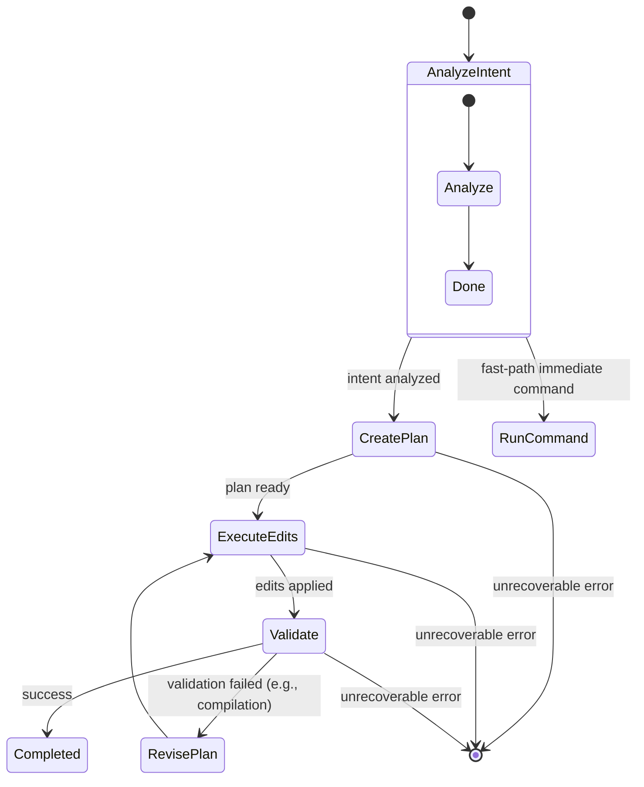

## Agent Control Flow (Source of Truth)

This document is the authoritative description of the agent control flow implemented under `pkg/agent`. If the code diverges from this flow, update this document first, then create TODOs to realign the implementation.

### Overview

Single-agent runs are initiated via `pkg/agent/agent_v2.go` (v2 default) and executed by the adaptive loop in `pkg/agent/orchestrator.go`. The agent iteratively evaluates progress, selects the next action, and executes until completion, error, or iteration cap.

### Entry Points

- `RunAgentModeV2(userIntent, skipPrompt, model)`
  - Loads config, initializes pricing, sets up v2 tool-driven loop
  - Calls interactive PEE loop via `agent_v2` → `orchestrator` execution
  - Prints token and cost summary via `PrintTokenUsageSummary(...)`

- `Execute(userIntent, cfg, logger) -> (*AgentTokenUsage, error)`
  - Perf logging (start/end)
  - Calls `runOptimizedAgent(...)`
  - Computes token split views for costing (no I/O here)

### Core Data Structures

- `AgentContext`
  - `UserIntent`, `IntentAnalysis`, `CurrentPlan`
  - `ExecutedOperations`, `Errors`, `ValidationResults`, `ValidationFailed`
  - `IterationCount`, `MaxIterations`, `StartTime`, `IsCompleted`
  - `TokenUsage *AgentTokenUsage`
  - `Config *config.Config`, `Logger *utils.Logger`

- `AgentTokenUsage`
  - Category totals: `IntentAnalysis`, `Planning`, `CodeGeneration`, `Validation`, `ProgressEvaluation`, `Total`
  - Split accounting per category: `SplitUsage{Prompt, Completion}` for precise cost calc

### Adaptive Loop

Implemented in `runOptimizedAgent`:
1. Initialize `AgentContext` and perf logging
2. Iteration loop (up to `MaxIterations`, default 25)
   - Opportunistic lightweight tools on early iterations:
     - `executeWorkspaceInfo` once
     - `executeListFiles(limit=10)` once
     - Grep-like discovery if intent contains find/search/grep -> `executeGrepSearch`
   - `evaluateProgress(context)` → returns `ProgressEvaluation` and tokens
     - Fast-path for simple tasks (`evaluateProgressFastPath`)
     - Full LLM evaluation for moderate/complex (`evaluateProgressWithLLM`)
   - Log status, next action, reasoning, concerns
   - Execute next action (see Actions section)
   - Break conditions:
     - `context.IsCompleted == true`
     - `evaluation.Status == "completed"` or `evaluation.NextAction == "completed"`
     - `IterationCount == MaxIterations` (warn and exit)
3. Final perf logging and exit

### Actions (NextAction → Function)

- `analyze_intent` → `analyzeIntentWithMinimalContext`
  - Builds/loads workspace metadata and relevant files via embeddings/content/shell fallbacks
  - Returns `IntentAnalysis{Category, Complexity, EstimatedFiles, RequiresContext}`
  - Token accounting: `IntentAnalysis`, updates split `IntentSplit.Prompt`
  - Fast-path: may execute an immediate safe shell command when applicable

- `create_plan` → `executeCreatePlan`
  - Calls `createDetailedEditPlan` (LLM) with workspace-informed prompt and constraints
  - Retries up to 3 times on empty/failed plans
  - Token accounting: `Planning` (+ split approx), logs plan summary

- `execute_edits` → `executeEditOperations`
  - Iterates planned `EditOperations` and performs full file edits via `editor.ProcessCodeGeneration`
  - Retries limited times per operation via `runSingleEditWithRetries`
  - Token accounting: `CodeGeneration` (+ `CodegenSplit` for prompt/completion)
  - Summarizes successes/failures; non-critical issues tolerated

- `run_command` → `executeShellCommands`
  - Executes shell commands (output truncated with safe limit)
  - Appends results/errors into context logs

- `validate` → `executeValidation`
  - Skips for read-only/doc tasks when appropriate
  - For simple tasks: `executeSimpleValidation` (build/tests as needed)
  - For complex tasks: `validateChangesWithIteration`
    - `determineValidationStrategy` (LLM, JSON)
    - Run steps via `runValidationStep`
    - `analyzeValidationResults` (LLM, JSON)
  - On failure sets `ValidationFailed = true` but does not abort; agent handles recovery
  - Token accounting: `Validation` (+ split approx)

- `revise_plan` → `executeRevisePlan`
  - If `ValidationFailed` and compilation errors detected, branches to recovery:
    - `executeValidationFailureRecovery` → creates fix-oriented `EditPlan`
  - Otherwise regenerates plan using `createDetailedEditPlan`
  - Token accounting: `Planning`

- `workspace_info` → `executeWorkspaceInfo`
- `grep_search` → `executeGrepSearch`
- `list_files` → `executeListFiles(limit)`

- `completed` → mark `IsCompleted = true`
- `continue` → no-op, loop continues

### Deterministic Guards in Progress Evaluation

Within `evaluateProgressWithLLM` the agent avoids analysis loops with deterministic checks:
- If a plan exists but no edits executed → next action = `execute_edits`
- If edits executed but validation not run → next action = `validate`
- If validation failed with compilation errors → next action = `revise_plan`

### Token and Cost Accounting

- Token usage is tracked per category with prompt/completion splits where available.
- At end of `RunAgentMode`, `PrintTokenUsageSummary(tokenUsage, duration, cfg)` prints:
  - Per-category token usage and total
  - Performance (tokens/second)
  - Cost Summary per category and total using `llm.CalculateCost` with model-specific pricing from `llm.GetModelPricing`
  - Persists per-run cost to `~/.ledit/agent_costs.json` and prints aggregated total cost

### Termination and Errors

- Hard stops only for unrecoverable action execution errors returned by the switch body in `runOptimizedAgent`.
- Otherwise, validation failures are recorded and the loop attempts recovery via plan revision.

### Extension Points and Non-Goals

- New actions can be added to the `NextAction` switch in `runOptimizedAgent`.
- Micro-edit flow is explicitly constrained and intended as an optimization, not a default.
- Multi-agent orchestration lives under `pkg/orchestration` and is out of scope for this document, but see `multi_agent_orchestrator.go` for per-agent budget and status tracking.

### State Diagram

### Traceability

Primary implementation references:
- `pkg/agent/entrypoint.go` → `RunAgentMode`, `Execute`
- `pkg/agent/orchestrator.go` → `runOptimizedAgent`
- `pkg/agent/tools.go` → `analyzeIntentWithMinimalContext`
- `pkg/agent/planning.go` → `createDetailedEditPlan`
- `pkg/agent/editing.go` → edit execution and retries
- `pkg/agent/validation.go`, `pkg/agent/validation_exec.go` → validation flows
- `pkg/agent/progress.go` → progress evaluation and deterministic guards
- `pkg/agent/costs.go` → token/cost summary and history

When modifying control flow, update this document first, then add TODOs in the affected files referencing the section to realign behavior.

