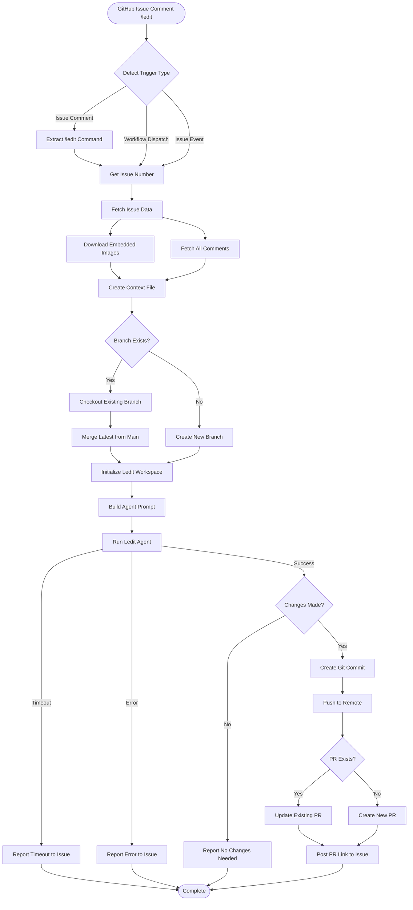
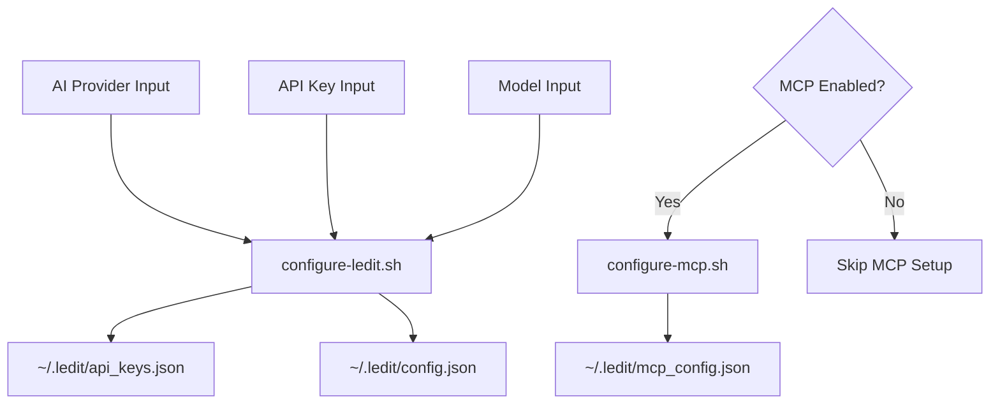
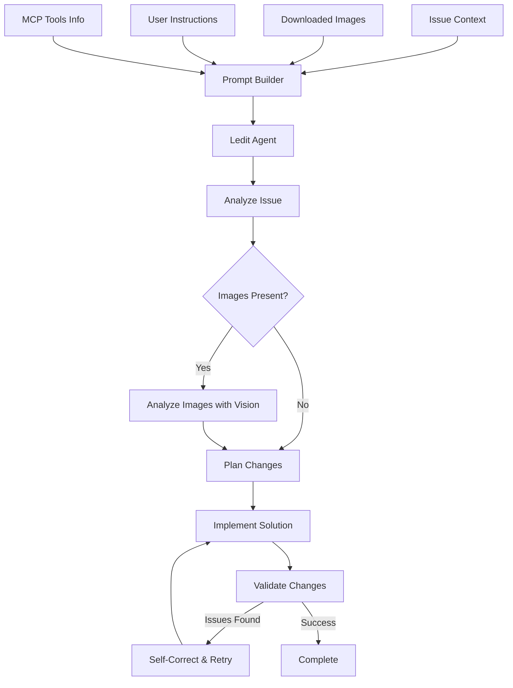

# Ledit Issue Solver - Visual Flow Diagram

## Complete Workflow Flow



## Detailed Component Interactions

### 1. Issue Data Collection Flow

```mermaid
flowchart LR
    Issue[GitHub Issue] --> API[GitHub API]
    API --> IssueJSON[issue.json]
    API --> CommentsJSON[comments.json]
    
    IssueJSON --> Parser[Content Parser]
    CommentsJSON --> Parser
    
    Parser --> ImageExtractor[Image Extractor]
    Parser --> ContextBuilder[Context Builder]
    
    ImageExtractor --> ImagesDir[/images Directory]
    ContextBuilder --> ContextMD[context.md]
```

### 2. Ledit Configuration Flow



### 3. Agent Execution Flow



## Key Decision Points

### Trigger Detection
- `/ledit` command → Process with optional user instructions
- Manual trigger → Process entire issue
- Issue event → Process on creation/update

### Branch Management
- Existing branch → Pull latest changes, handle conflicts
- New branch → Create from default branch

### PR Management
- Existing PR → Add update comment
- New PR → Create with full description

### Error Handling
- Timeout → Report with action logs link
- No changes → Explain possible reasons
- Failure → Provide debugging guidance

## Data Flow Summary

1. **Input**: GitHub issue with description, comments, and images
2. **Processing**: Ledit agent analyzes and implements solution
3. **Output**: Git branch with changes and pull request

## State Management

The action maintains state through:
- Environment variables (GITHUB_ENV)
- Temporary files (/tmp/ledit-issue-*)
- Git branch state
- GitHub Action outputs

## Parallel Operations

Some operations run in parallel for efficiency:
- Image downloads (multiple concurrent)
- API pagination (when supported)
- File operations (minimal blocking)

## Cost Optimization

The action optimizes costs by:
- Configurable timeouts
- Efficient context building
- Reusing existing branches
- Minimal API calls