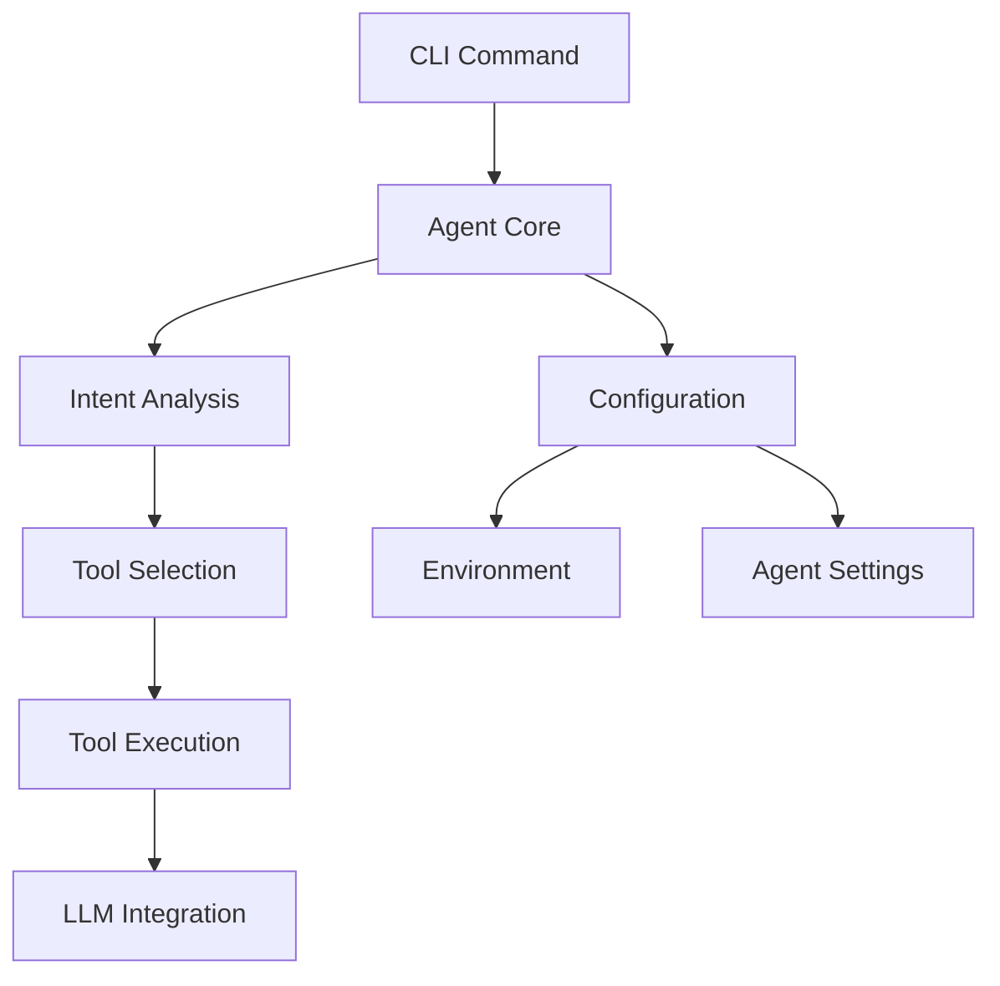

# Agent Template Guide

This guide provides a comprehensive blueprint for creating simplified, configurable agent templates based on the ledit architecture.

## Overview

The templatized agent system extracts the essential components from the ledit project to create focused, configurable AI agents. The template includes:

- **Core Agent Framework**: Simplified intent analysis and task execution
- **Tool System**: Pluggable tools with standardized interfaces
- **LLM Integration**: Provider abstraction with multiple LLM support
- **Configuration System**: YAML-based configuration with environment variable support
- **CLI Framework**: Command-line interface for agent interaction

## Quick Start

### 1. Run the Setup Script

```bash
# From the ledit project root
cd /Users/alanp/dev/personal/ledit
bash docs/templatized_agent/setup/setup.sh /path/to/your/agent simple-agent
```

### 2. Configure Your Agent

```bash
cd /path/to/your/agent
cp configs/default.yaml config.yaml
# Edit config.yaml with your settings
```

### 3. Set API Keys

```bash
export OPENAI_API_KEY="your-openai-api-key"
# Or for other providers:
export ANTHROPIC_API_KEY="your-anthropic-api-key"
export GEMINI_API_KEY="your-gemini-api-key"
```

### 4. Build and Run

```bash
make build
./bin/agent "your task here"
```

## Architecture Overview

### Core Components

```
agent-template/
├── cmd/                    # CLI commands
├── pkg/
│   ├── agent/            # Core agent logic
│   ├── tools/            # Tool system
│   ├── llm/              # LLM integration
│   ├── config/           # Configuration
│   ├── utils/            # Utilities
│   └── filesystem/       # File operations
├── configs/              # Configuration templates
├── examples/             # Usage examples
└── docs/                 # Documentation
```

### Component Relationships



## Configuration System

### Configuration Hierarchy

The system supports a clear configuration hierarchy:

1. **Command-line flags** (highest priority)
2. **Environment variables**
3. **Configuration file**
4. **Default values** (lowest priority)

### Main Configuration Structure

```yaml
# config.yaml
agent:
  name: "My Agent"
  description: "Agent description"
  goals:
    - "Goal 1"
    - "Goal 2"
  tools:
    - "read_file"
    - "edit_file"
    - "run_shell"

  # Behavior settings
  max_iterations: 10
  timeout: "5m"
  interactive: true

llm:
  provider: "openai"
  model: "gpt-4o-mini"
  temperature: 0.7
  max_tokens: 4096

  # Provider-specific settings
  openai:
    api_key: "${OPENAI_API_KEY}"
    base_url: "https://api.openai.com/v1"

environment:
  workspace_root: "."
  log_level: "info"
  enable_cache: true
```

### Environment Variables

Use environment variables for sensitive data:

```bash
# API Keys
export OPENAI_API_KEY="sk-..."
export ANTHROPIC_API_KEY="sk-ant-..."

# Configuration
export AGENT_CONFIG_FILE="config.yaml"
export AGENT_LOG_LEVEL="debug"

# Runtime settings
export AGENT_DRY_RUN="false"
export AGENT_INTERACTIVE="true"
```

## Tool System

### Built-in Tools

The template includes several built-in tools:

#### 1. File Operations
```yaml
tools:
  read_file:
    enabled: true
    max_file_size: "1MB"
  edit_file:
    enabled: true
    backup: true
```

#### 2. Shell Operations
```yaml
tools:
  run_shell:
    enabled: true
    allowed_commands: ["git", "npm", "go"]
    timeout: "30s"
    require_approval: true
```

#### 3. User Interaction
```yaml
tools:
  ask_user:
    enabled: true
    max_retries: 3
```

### Custom Tools

To add custom tools:

1. **Implement the Tool interface**:
```go
type MyTool struct{}

func (t *MyTool) Name() string { return "my_tool" }
func (t *MyTool) Description() string { return "My custom tool" }
func (t *MyTool) Execute(ctx context.Context, params Parameters) (*Result, error) {
    // Tool implementation
    return &Result{Success: true}, nil
}
```

2. **Register the tool**:
```go
func init() {
    registry := tools.GetRegistry()
    registry.RegisterTool(&MyTool{})
}
```

3. **Add to configuration**:
```yaml
tools:
  my_tool:
    enabled: true
    config:
      param1: "value1"
```

## LLM Integration

### Supported Providers

The template supports multiple LLM providers:

#### OpenAI
```yaml
llm:
  provider: "openai"
  model: "gpt-4"
  openai:
    api_key: "${OPENAI_API_KEY}"
```

#### Anthropic
```yaml
llm:
  provider: "anthropic"
  model: "claude-3-sonnet-20240229"
  anthropic:
    api_key: "${ANTHROPIC_API_KEY}"
```

#### Gemini
```yaml
llm:
  provider: "gemini"
  model: "gemini-1.5-pro"
  gemini:
    api_key: "${GEMINI_API_KEY}"
```

### Provider Selection Guidelines

| Provider | Use Case | Cost | Speed | Context Window |
|----------|----------|------|-------|----------------|
| OpenAI | General purpose | Medium | Fast | Large |
| Anthropic | Complex reasoning | High | Medium | Very Large |
| Gemini | Web search integration | Low | Fast | Large |

## Agent Workflows

### Basic Workflow

```go
func (a *Agent) Execute(intent string) error {
    // 1. Analyze intent
    intentType := a.analyzeIntent(intent)

    // 2. Create todo list
    todos := a.createTodos(intentType, intent)

    // 3. Execute todos
    for _, todo := range todos {
        result := a.executeTodo(todo)
        a.processResult(result)
    }

    // 4. Generate summary
    return a.generateSummary()
}
```

### Intent Types

The agent recognizes several intent types:

- **Code Update**: Code changes, refactoring, feature implementation
- **Question**: Information requests, explanations
- **Command**: Shell commands, file operations
- **Analysis**: Code analysis, security review, performance optimization

### Todo Management

```go
type TodoItem struct {
    ID          string `json:"id"`
    Content     string `json:"content"`
    Description string `json:"description"`
    Status      string `json:"status"` // pending, in_progress, completed, failed
    FilePath    string `json:"file_path"`
    Priority    int    `json:"priority"`
}
```

## Extending the Template

### Adding New Capabilities

1. **New Tools**: Implement additional tools for specific domains
2. **New Workflows**: Add custom execution patterns
3. **New Providers**: Support additional LLM providers
4. **New Features**: Add domain-specific functionality

### Customization Points

```go
// pkg/agent/agent.go - Main agent logic
// pkg/tools/ - Add custom tools
// pkg/llm/ - Add new LLM providers
// pkg/config/ - Extend configuration
// cmd/ - Add new CLI commands
```

### Best Practices

1. **Keep it simple**: Start with minimal functionality
2. **Test thoroughly**: Test each component independently
3. **Document well**: Document configuration and usage
4. **Handle errors**: Implement proper error handling
5. **Secure by default**: Include security considerations

## Example Use Cases

### 1. Code Assistant

```yaml
agent:
  name: "Code Assistant"
  goals: ["Write code", "Fix bugs", "Review code"]
  tools: ["read_file", "edit_file", "run_tests"]

llm:
  provider: "openai"
  model: "gpt-4"
```

### 2. Documentation Specialist

```yaml
agent:
  name: "Documentation Specialist"
  goals: ["Generate docs", "Update README", "Create tutorials"]
  tools: ["read_file", "edit_file", "web_search"]

llm:
  provider: "gemini"
  model: "gemini-1.5-pro"
```

### 3. Security Analyst

```yaml
agent:
  name: "Security Analyst"
  goals: ["Find vulnerabilities", "Review security", "Suggest fixes"]
  tools: ["read_file", "run_security_scan", "analyze_dependencies"]

llm:
  provider: "anthropic"
  model: "claude-3-sonnet-20240229"
  temperature: 0.1  # Low temperature for security
```

## Deployment

### Docker Deployment

```dockerfile
FROM golang:1.21-alpine AS builder
WORKDIR /app
COPY . .
RUN go build -o agent main.go

FROM alpine:latest
RUN apk --no-cache add ca-certificates
WORKDIR /root/
COPY --from=builder /app/agent .
COPY --from=builder /app/configs ./configs
CMD ["./agent"]
```

### Systemd Service

```ini
[Unit]
Description=AI Agent Service
After=network.target

[Service]
Type=simple
User=agent
WorkingDirectory=/opt/agent
ExecStart=/opt/agent/bin/agent --config /opt/agent/config.yaml
Restart=always
EnvironmentFile=/opt/agent/.env

[Install]
WantedBy=multi-user.target
```

## Troubleshooting

### Common Issues

1. **Configuration not loading**: Check file permissions and YAML syntax
2. **API key issues**: Verify environment variables are set correctly
3. **Tool execution failures**: Check tool permissions and system dependencies
4. **LLM provider errors**: Verify API endpoints and rate limits

### Debug Mode

Enable debug logging for detailed information:

```bash
export AGENT_LOG_LEVEL=debug
./bin/agent "your task"
```

### Health Checks

```bash
# Check configuration
./bin/agent --validate-config

# Test LLM connection
./bin/agent --test-llm

# List available tools
./bin/agent --list-tools
```

## Performance Tuning

### LLM Optimization

- **Model selection**: Choose appropriate model size for task complexity
- **Temperature**: Lower for deterministic tasks, higher for creative tasks
- **Max tokens**: Set based on expected output length
- **Caching**: Enable response caching for repeated queries

### Resource Management

- **Memory limits**: Set appropriate memory limits for containerized deployment
- **Concurrency**: Limit concurrent agent executions
- **Timeouts**: Set reasonable timeouts to prevent hanging
- **Rate limiting**: Implement rate limiting for API calls

## Security Considerations

### 1. API Key Security
- Never store API keys in configuration files
- Use environment variables or secure credential stores
- Rotate keys regularly

### 2. File System Security
- Limit file system access to specific directories
- Validate all file paths
- Implement file permission checks

### 3. Tool Security
- Require approval for dangerous operations
- Validate tool inputs
- Implement tool execution timeouts

### 4. Network Security
- Use HTTPS for all API calls
- Implement request signing when possible
- Validate SSL certificates

## Contributing

To extend the template:

1. **Fork and modify**: Create your own version for specific use cases
2. **Add tools**: Implement domain-specific tools
3. **Improve configuration**: Add configuration options for your use case
4. **Test thoroughly**: Ensure all changes work correctly
5. **Document**: Update documentation for new features

## License

This template is based on the ledit project architecture and follows the same licensing terms.

---

This template provides a solid foundation for building custom AI agents while maintaining the flexibility and robustness of the original ledit architecture. Start simple, test thoroughly, and extend as needed for your specific use cases.
